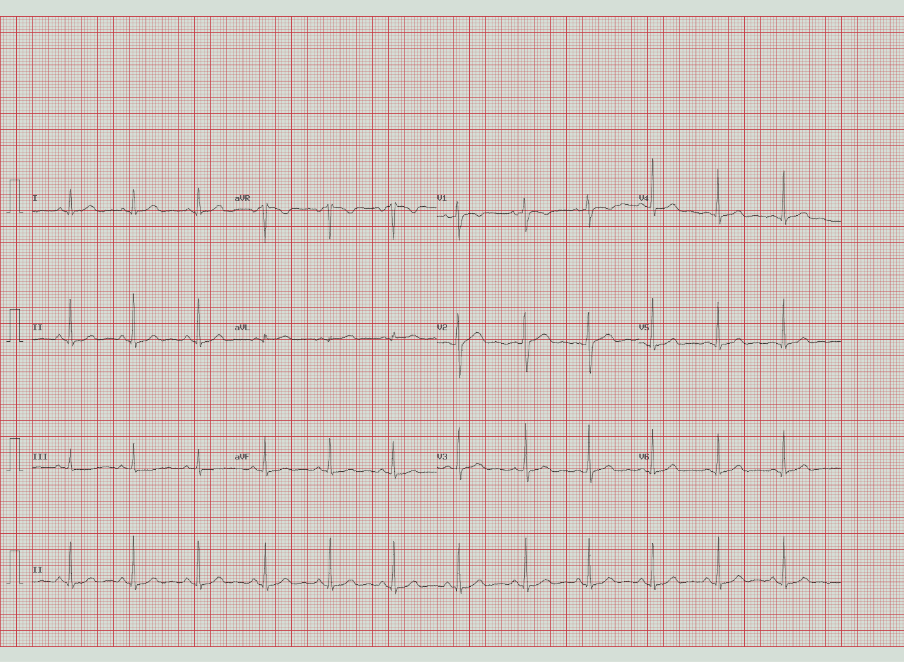

# 原始题

Question: 看这张12导联ECG,下列哪项参数分析与诊断是正确的?
Options:
A: HR 75.0 bpm（窦性节律），PR 146.0 ms，QRS 90.0 ms，QTc 433.0 ms，电轴12SL=59.0°/unig=60.0°（正常） → 诊断: 正常心电图、窦性心律
B: HR 45.0 bpm（窦性节律、心率过缓），PR 146.0 ms，QRS 90.0 ms，QTc 433.0 ms，电轴12SL=59.0°/unig=60.0°（正常） → 诊断: 窦性心动过缓
C: HR 75.0 bpm（窦性节律），PR 220.0 ms（延长），QRS 90.0 ms，QTc 433.0 ms，电轴12SL=59.0°/unig=60.0°（正常） → 诊断: 一度房室传导阻滞
D: HR 75.0 bpm（窦性节律），PR 146.0 ms，QRS 130.0 ms（增宽），QTc 433.0 ms，电轴12SL=59.0°/unig=60.0°（正常） → 诊断: 室内传导阻滞
Please reason step by step, and put your final answer within \boxed{}.

## Answer key

- Gold: `A`
- Answer: HR 75.0 bpm（窦性节律），PR 146.0 ms，QRS 90.0 ms，QTc 433.0 ms，电轴12SL=59.0°/unig=60.0°（正常） → 诊断: 正常心电图、窦性心律
- Label status: `dataset_provided_annotation`
