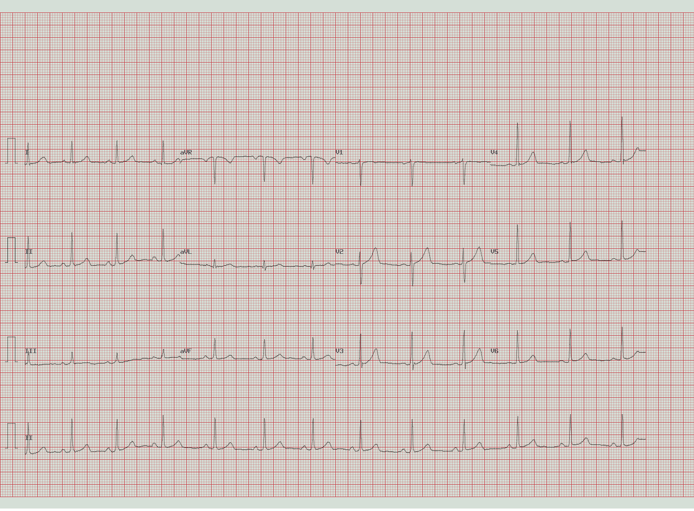

# 原始题

Question: 看这张12导联ECG,下列哪项参数分析与诊断是正确的?
Options:
A: 窦性心律，HR 74.0 bpm；PR 146.0 ms；QRS 74.0 ms；QTc 415.0 ms；电轴49.0°（正常） → 诊断: 正常心电图（窦性心律）
B: 窦性心律，HR 48.0 bpm；PR 146.0 ms；QRS 74.0 ms；QTc 415.0 ms；电轴49.0°（正常） → 诊断: 窦性心动过缓
C: 窦性心律，HR 74.0 bpm；PR 220.0 ms；QRS 74.0 ms；QTc 415.0 ms；电轴49.0°（正常） → 诊断: 一度房室传导阻滞
D: 窦性心律，HR 74.0 bpm；PR 146.0 ms；QRS 74.0 ms；QTc 490.0 ms；电轴49.0°（正常） → 诊断: QT间期延长
Please reason step by step, and put your final answer within \boxed{}.

## Answer key

- Gold: `A`
- Answer: 窦性心律，HR 74.0 bpm；PR 146.0 ms；QRS 74.0 ms；QTc 415.0 ms；电轴49.0°（正常） → 诊断: 正常心电图（窦性心律）
- Label status: `dataset_provided_annotation`
